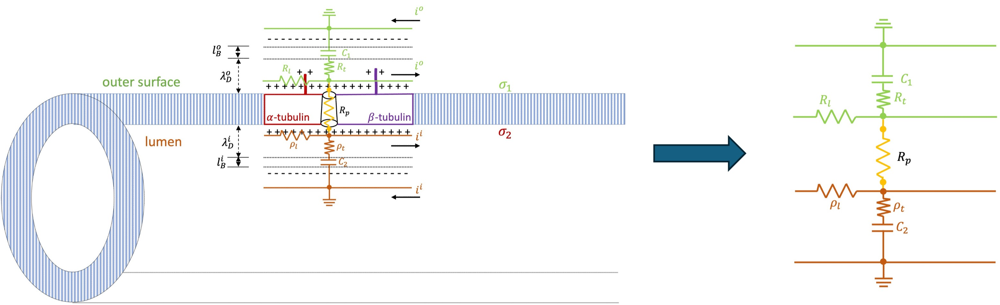
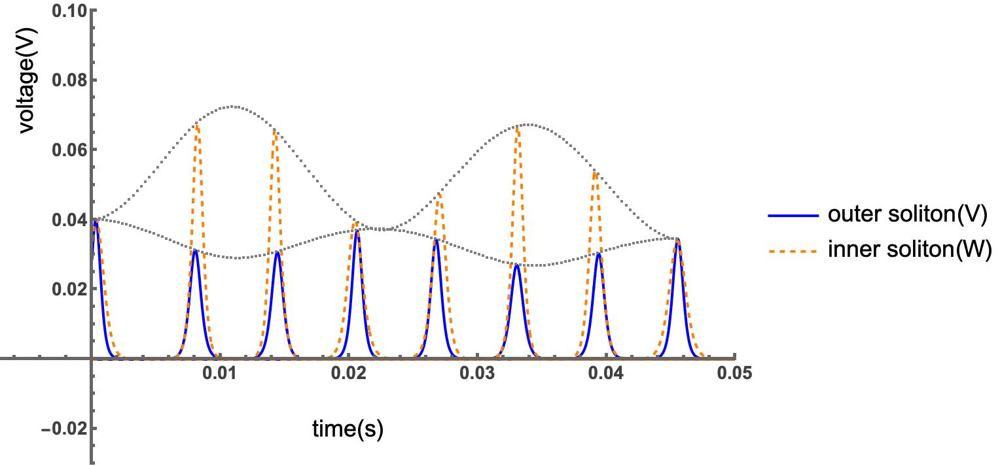

# EOMT
# 🧠 Microtubule Simulation Notebooks

This repository contains a suite of **Mathematica notebooks** implementing a **multi-scale nonlinear transmission-line model** of **electrical oscillations in microtubules (MTs)**. It integrates **Poisson–Boltzmann electrostatics**, **nanopore conduction modeling**, and **confidence-interval analyses** to reproduce and validate experimental oscillation frequencies (~39 Hz) and explore oscillatory nonlinear ionic signal propagation. The project provides a reproducible computational framework accompanying the manuscript
**“Electrical Oscillations in Microtubules” (Mohsin, Cantiello, Cantero, & Marucho, 2025).**

---

## 📂 Directory Structure

```
MT simulation notebooks/
├── microtubule master notebook 004V.nb
├── microtubule master notebook 008V.nb
├── nanopremodel_2s3b_fitting.nb
│
├── CI/
│ ├── CIsimulate004.nb
│ ├── CIsimulate008.nb
│ ├── model004.nb
│ └── model008.nb
│
├── MT Poisson calculations/
│ ├── MT-poisson-calculations-symbolic-rhoL.nb
│ ├── MT-poisson-calculations-symbolic-Rl.nb
│ ├── MT-poisson-solution-capacitance.nb
│ └── MT-poisson-solution-plot-Resistances-Rl-rhol.nb
│
└── pore resistance simulation/
├── microtubule_master_notebook_freq.nb
├── nanoporemodel.nb
└── Rpi.nb
```

---

## 🧩 Notebook Descriptions

### **Master Notebooks**

#### **microtubule master notebook 004V.nb**
Implements the **coupled nonlinear transmission-line model** of a microtubule at **0.04 V input potential**.  
Integrates data from *MT Poisson calculations* and *pore resistance simulation* modules to numerically solve for soliton dynamics on the inner and outer cylindrical layers.

**Features**
- Initializes circuit parameters (resistance, capacitance, impedance).  
- Calculte coefficients in the differential equations using Eq. S33 -- S44.  
- Solves the coupled ODEs (Eq. S47, S50, S57, and S58) for two soliton modes using `NDSolve`.  
- Generates voltage propagation and soliton velocity plots.  
- Computes damping coefficients and performs FFT analysis.  

**Purpose:**  
Simulates **oscillations and soliton coupling** in MTs at input voltages typical in patch clamp experiments.

---

#### **microtubule master notebook 008V.nb**
Extends the simulation to **0.08 V input potential**, analyzing the nonlinear effects of higher driving voltage.

**Features**
- Recalculates electrical parameters for Vinp = 0.08 V.  
- Solves coupled nonlinear equations and plots voltages.  
- Computes soliton velocity and damping profiles.  
- FFT confirms dominant frequency.  

**Purpose:**  
Explores how **increased driving voltage** preserves the oscillatory behavior.

---

#### **nanopremodel_2s3b_fitting.nb**
Fits the **two-state three-barrier (2S3B)** nanopore conduction model to obtain **pore resistance as a function of input voltage**.

**Features**
- Imports RpData from *pore resistance simulation*.  
- Defines the 2S3B kinetic model (Eq. 9 in the article).  
- Fits I–V data with `NonlinearModelFit`.  
- Extracts parameters: A, G₂/G₃, G₂₃, d₁, d₂, d₃.  
- Plots fitted vs. measured currents.  

**Purpose:**  
Fits the **pore resistance–voltage relationship**.

---

### **MT Poisson Calculations**

This folder derives the **electrostatic and transport parameters** (ρₗ, Rₗ, C₁₀, C₂₀) used in the coupled transmission-line model.

#### **MT-poisson-calculations-symbolic-rhoL.nb**
Derives symbolic expression for **longitudinal resistivity (ρₗ)** from the linearized Poisson–Boltzmann equation under cylindrical symmetry (Eq. S2 -- S11).  
**Purpose:** Analytical foundation for inner-layer conduction.

---

#### **MT-poisson-calculations-symbolic-Rl.nb**
Symbolic derivation for the **outer-layer resistance (Rₗ)** in the cytoplasmic region.  
**Purpose:** Quantifies current transport in the outer conduction pathway using Eq. S2 -- S11.

---

#### **MT-poisson-solution-capacitance.nb**
Computes **inner (C₂₀)** and **outer (C₁₀)** capacitances from Δσ/Δϕ relationships.  
**Results:** C₁₀ ≈ 2.3 × 10⁻¹⁶ F; C₂₀ ≈ 1.4 × 10⁻¹⁶ F.

---

#### **MT-poisson-solution-plot-Resistances-Rl-rhol.nb**
Evaluates numerical values for **Rₗ** and **ρₗ**, using experimental constants.  
**Results:** Rₗ ≈ 6.2 × 10⁶ Ω; ρₗ ≈ 1.8 × 10⁷ Ω.  


---

### **Pore Resistance Simulation**

Determines **voltage-dependent pore resistance (Rₚ)** ensuring that oscillation frequency ≈ 39 Hz.  
Only `nanoporemodel.nb` should be manually run; the rest are dependencies.

#### **nanoporemodel.nb**
Main driver notebook.  
Iterates over input voltages (0.01–0.10 V) calling `Rpi.nb` to compute Rₚ that yields a 39 Hz frequency.  
**Output:** RpData table used in nanopore fitting and in simulation notebooks.

---

#### **Rpi.nb**
Performs iterative root-finding (bisection) to match oscillation frequency to 39 Hz.  
**Execution:** Automatically called by `nanoporemodel.nb`.

---

#### **microtubule_master_notebook_freq.nb**
Computes the **dominant oscillation frequency** for given parameters.  
Defines functions `asymSolFun[]` and `dominantFreq[]`.  
**Execution:** Called by `Rpi.nb`.

---

### **CI (Confidence Interval Analysis)**

Performs **bootstrap uncertainty analysis** on frequency and damping metrics.  
Each simulation notebook calls its corresponding model automatically.

#### **CIsimulate004.nb**
Envelop and bootstrap analysis for **0.04 V input**.  
Applies ±10 % envelope to RpData. Also applies ±10 % random perturbation per data point (n = 300 runs) and computes 95 % CIs for frequency and damping.  

---

#### **model004.nb**
Defines the **0.04 V coupled transmission-line equations** solved by `CIsimulate004.nb`.

**Execution:** Automatically called by `CIsimulate004.nb`.

---

#### **CIsimulate008.nb**
Repeats the same workflow for **0.08 V input**, evaluating nonlinear effects on CI estimates.

---

#### **model008.nb**
Defines the **0.08 V coupled model** called by `CIsimulate008.nb`.

---

## 🔍 Example Outputs

Representative outputs from the simulations and analyses illustrating the workflow and results of the multi-scale microtubule model.

---

### **1. Multi-scale Electrokinetic Model of Microtubules**



*Figure 1.* Conceptual schematic of the multi-scale electrokinetic model for microtubules.  
The inner and outer electrical double layers (EDLs) are modeled as **coupled nonlinear transmission lines**, connected through **voltage-dependent nanopores** across the microtubule wall.  
This provides the theoretical foundation for the soliton and oscillation simulations performed in the Mathematica notebooks.

---

### **2. Soliton Voltage Propagation (4 mV Input)**



*Figure 2.* Numerical solution of the coupled transmission-line equations showing the voltage versus time for the 0.04 V input case.  
The oscillatory soliton pair exhibits **leap-frogging dynamics** and **exponential damping**, consistent with experimental oscillation frequencies near 39 Hz.

---

### **3. Confidence-Interval Results (Bootstrap Analysis)**

| Metric | 2.5 % | Median | 97.5 % |
|:--|--:|--:|--:|
| **Frequency (Hz)** | 35.1702 | 39.078 | 41.0319 |
| **Damping (1/τ)** | 0.00122787 | 0.00122999 | 0.00188334 |

*Table 1.* Bootstrap-derived confidence intervals for the main oscillation metrics at 0.04 V input voltage, demonstrating robust frequency convergence and stable damping behavior across random resamplings of pore resistance data.

---

### 🧪 How to Reproduce These Outputs

| Output / Dataset | Notebook(s) to Run | Description |
|:--|:--|:--|
| **Pore resistance data (`RpData`)** | `pore resistance simulation/nanoporemodel.nb` → auto-calls `Rpi.nb` and `microtubule_master_notebook_freq.nb` | Iteratively determines the voltage-dependent pore resistance that yields the 39 Hz oscillation frequency. |
| **Nanopore model fit** | `nanopremodel_2s3b_fitting.nb` | Fits the two-state three-barrier (2S3B) model to compute nanopore parameters. |
| **Model schematic (Fig. 1)** | – (from manuscript figure) | Conceptual model showing coupled transmission lines and nanopores. |
| **Soliton propagation (Fig. 2)** | `microtubule master notebook 004V.nb` | Simulates soliton propagation at 0.04 V input. |
| **CI table (Table 1)** | `CI/CIsimulate004.nb` → auto-calls `model004.nb` | Performs bootstrap analysis (300 iterations) for frequency and damping. |


> 💡 **Tips:**  
> - Verify all subfolder paths for `NotebookEvaluate[...]`.  
> - Run notebooks sequentially for consistent parameter sharing.  
> - Mathematica 12+ recommended.

---

## 🧭 User Guide

### **1. Software Requirements**
- Mathematica v12 or newer  
- macOS, Windows, or Linux  
- ≥16 GB RAM  
- Maintain folder: `MT simulation notebooks/`

---

### **2. Folder Setup**
```
MT simulation notebooks/
├── MT Poisson calculations/
├── pore resistance simulation/
├── CI/
└── *.nb (master notebooks)
```

---

### **3. Execution Workflow**

| Step | Notebook | Purpose |
|:--|:--|:--|
| 1 | `MT Poisson calculations/*.nb` | Compute Rₗ, ρₗ, C₁₀, C₂₀. |
| 2 | `pore resistance simulation/nanoporemodel.nb` | Generate RpData. |
| 3 | `nanopremodel_2s3b_fitting.nb` | Fit nanopore model. |
| 4 | `microtubule master notebook final 004V.nb` | Run 0.04 V simulation. |
| 5 | `microtubule master notebook final 008V.nb` | Run 0.08 V simulation. |
| 6 | `CI/CIsimulate004.nb` | Bootstrap analysis for 0.04 V. |
| 7 | `CI/CIsimulate008.nb` | Bootstrap analysis for 0.08 V. |

---

### **4. Typical Runtime**
| Task | Duration |
|:--|--:|
| Poisson parameter derivation | 2–5 min |
| Pore resistance iteration | 5–10 min |
| Master simulation | 10–15 min |
| CI bootstrap | 20–30 min |

---

### **5. Expected Outputs**
- RpData table  
- Soliton voltage plots V(t), W(t)
- FFT frequency ≈ 39 Hz  
- CI summary table  

---

### **6. Troubleshooting**
- Check `NotebookEvaluate[...]` paths.  
- Clear Mathematica kernel before re-runs.  
- Use *Evaluate Notebook* for reproducibility.  

---

### **7. Suggested Verification**
1. Run `microtubule master notebook final 004V.nb`.  
2. Confirm `CIsimulate004.nb` produces matching frequency.  
3. Repeat for 008V case.

---
## 📘 Citation

If you use or adapt this repository, please cite the corresponding article:

> Mohsin, M., Cantiello, H. F., Cantero, M. D. R., & Marucho, M. (2025).  
> *Electrical Oscillations in Microtubules.* **Biophysics.**  
> https://doi.org/10.1101/2025.08.25.672199

## 🧾 License

This repository and all associated Mathematica notebooks are provided for **academic and research use only**.

You are free to:
- **Use** the notebooks for personal or academic research.
- **Modify** the code for internal or educational purposes.
- **Cite** the work in your publications or theses, provided proper attribution is given.

You may **not**:
- Redistribute modified or unmodified versions without author permission.
- Use the code or data for commercial purposes without prior written consent.

**Copyright © 2025 Md Mohsin and co-authors**  
All rights reserved.

For inquiries regarding reuse or collaboration, please contact the corresponding author.

